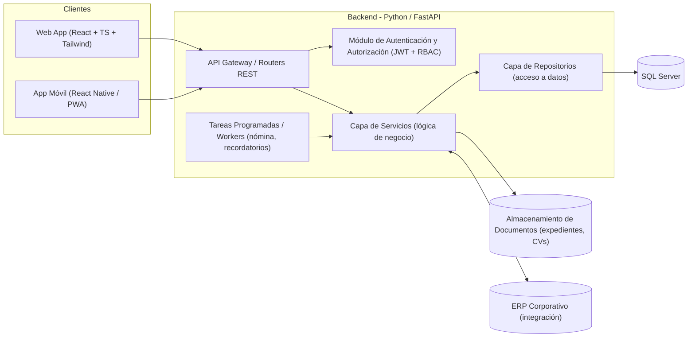
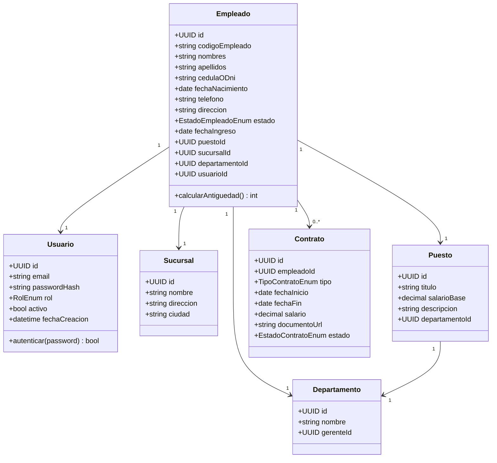
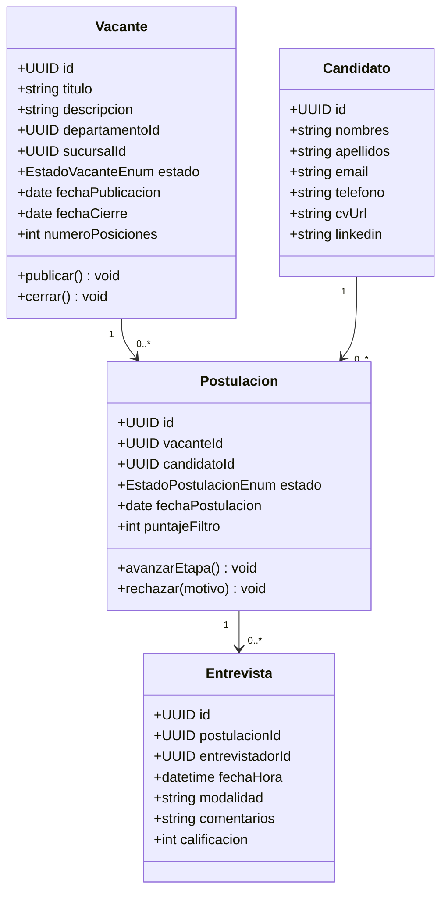
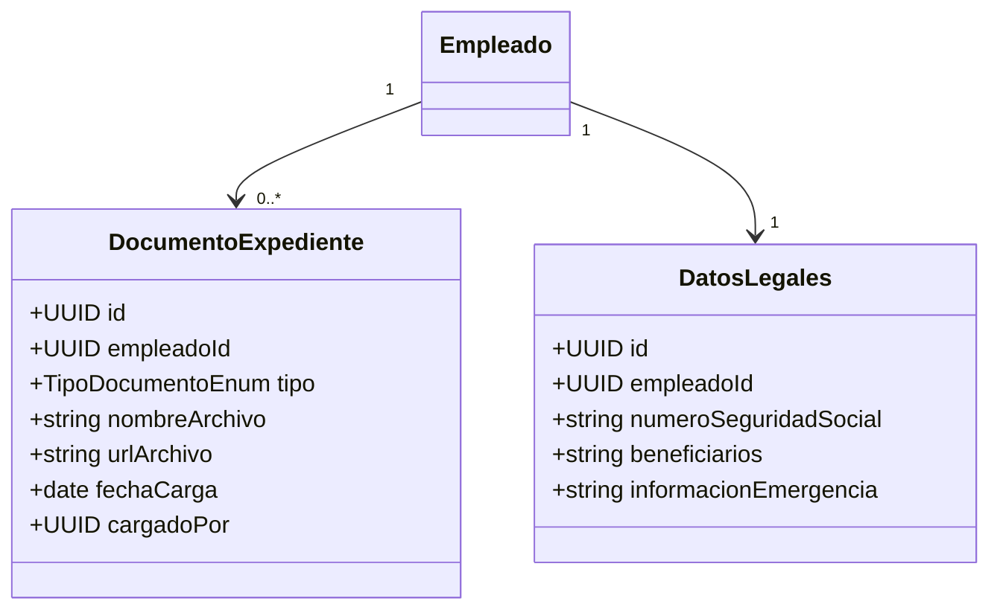
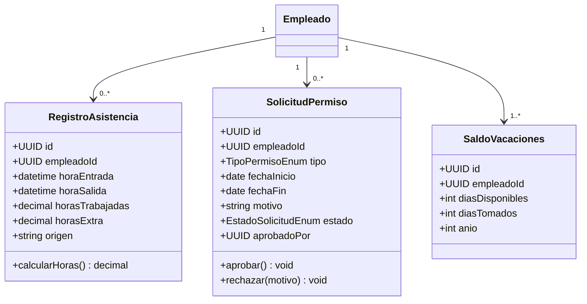
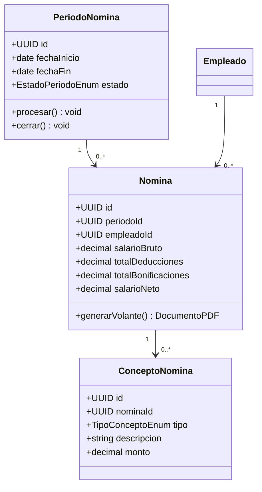
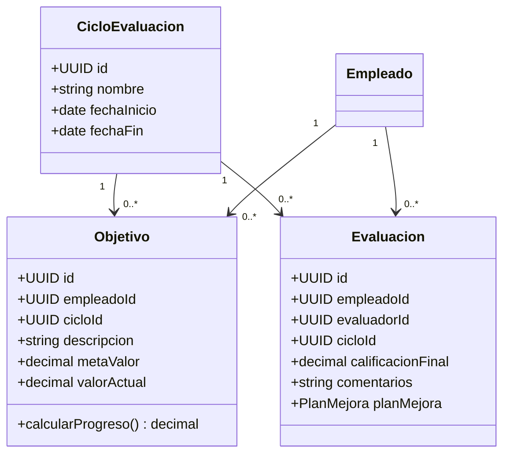
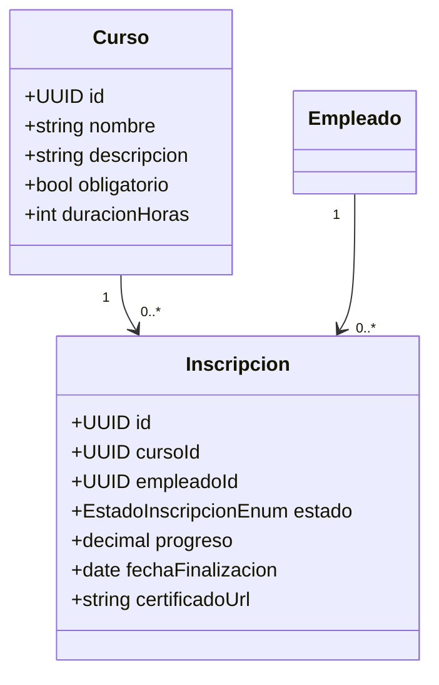

# Talento360-HR — Especificación Técnica del Backend

**Proyecto:** Sistema de Gestión de Recursos Humanos (HRM)
**Empresa (ficticia):** Global Retail Solutions, S.A.
**Grupo:** Grupo 6 — Práctica de Ingeniería de Software
**Documento:** Especificación de sistema, clases, arquitectura y diseño del backend

> Este documento traduce la propuesta presentada en el PPT (empresa, objetivos, stack tecnológico y módulos del HRM) en una especificación técnica concreta del backend: arquitectura en capas, modelo de dominio, clases, endpoints y decisiones de diseño. Las secciones 1 y 2 resumen fielmente el contenido del PPT; de la sección 3 en adelante se detalla el diseño técnico propuesto para implementarlo.

---

## 1. Resumen del Proyecto (según el PPT)

### 1.1 Empresa y proyecto

| Campo | Detalle |
|---|---|
| Empresa | Global Retail Solutions, S.A. — sector retail, +350 colaboradores en múltiples sucursales a nivel nacional |
| Necesidad | Control centralizado de personal |
| Nombre del proyecto | **Talento360-HR** |
| Naturaleza | Módulo web integral para automatizar, gestionar y optimizar el ciclo de vida del colaborador |

### 1.2 Descripción del proyecto

Creación de un módulo **web y móvil**, integrado al ERP existente, que automatiza:
- Reclutamiento
- Expedientes digitales
- Control de asistencia
- Cálculo de nómina
- Portal de autoservicio

### 1.3 Objetivos

**General:** optimizar los tiempos administrativos y centralizar la información del personal.

**Específicos:**
- Automatizar los procesos de selección y contratación.
- Facilitar el autoservicio a los empleados (solicitud de vacaciones y descarga de volantes de pago).

### 1.4 Stack tecnológico declarado en el PPT

| Capa | Tecnología |
|---|---|
| Frontend | React.js / TypeScript, Tailwind CSS |
| Backend | Python / FastAPI (API RESTful) |
| Base de datos | SQL Server |
| Herramientas | Git, GitHub, Jira (metodología ágil), Docker (contenedorización), Postman (pruebas de API) |

### 1.5 Módulos del sistema HRM identificados

1. **Reclutamiento (ATS)** — vacantes, publicación en bolsas de empleo, filtrado de CVs, entrevistas.
2. **Expediente Digital** — datos personales, contratos y datos legales, almacenados de forma centralizada y segura.
3. **Asistencia y Tiempo** — entradas/salidas, horas extra, permisos, vacaciones.
4. **Nómina (Payroll)** — cálculo de salarios, deducciones fiscales, bonificaciones, prestaciones de ley.
5. **Desempeño y KPIs** — objetivos, evaluaciones continuas, planes de mejora.
6. **Capacitación (LMS)** — planes de formación, cursos obligatorios, desarrollo de habilidades.
7. **Autoservicio (ESS)** — portal para volantes de pago y solicitud de permisos/vacaciones.

---

## 2. Alcance de esta especificación

El PPT define el **qué** (propuesta funcional) y el **con qué** (stack). Este documento define el **cómo** del backend: arquitectura, patrones, modelo de datos, contratos de API y estructura de clases necesarios para construir Talento360-HR sobre FastAPI + SQL Server.

---

## 3. Arquitectura General del Sistema

### 3.1 Vista de alto nivel



### 3.2 Estilo arquitectónico

Arquitectura en **capas (layered architecture)** con separación estricta de responsabilidades, organizada además en **módulos por dominio** (uno por cada módulo HRM del PPT), siguiendo un enfoque cercano a *screaming architecture* / *modular monolith*:

```
app/
├── main.py                     # Punto de entrada FastAPI, montaje de routers
├── core/
│   ├── config.py                # Variables de entorno, settings (Pydantic Settings)
│   ├── security.py               # JWT, hashing de contraseñas, RBAC
│   ├── database.py               # Engine SQLAlchemy, sesión, conexión a SQL Server
│   └── exceptions.py             # Excepciones y handlers globales
├── shared/
│   ├── models.py                  # Modelos base (BaseModel, TimestampMixin)
│   ├── schemas.py                 # Schemas Pydantic comunes (paginación, respuestas)
│   └── utils.py
├── modules/
│   ├── auth/                      # Autenticación, usuarios, roles
│   ├── empleados/                 # Expediente Digital
│   ├── reclutamiento/             # ATS
│   ├── asistencia/                # Asistencia y Tiempo
│   ├── nomina/                    # Payroll
│   ├── desempeno/                 # Desempeño y KPIs
│   ├── capacitacion/              # LMS
│   └── autoservicio/              # ESS
│       ├── router.py               # Endpoints FastAPI (capa de presentación/API)
│       ├── schemas.py              # DTOs de entrada/salida (Pydantic)
│       ├── models.py               # Entidades ORM (SQLAlchemy)
│       ├── service.py              # Reglas de negocio
│       ├── repository.py           # Consultas a la base de datos
│       └── exceptions.py           # Errores propios del módulo
└── tests/
```

### 3.3 Patrones de diseño aplicados

| Patrón                               | Uso en el sistema                                                                                                        |
| ------------------------------------ | ------------------------------------------------------------------------------------------------------------------------ |
| **Layered Architecture**             | Router → Service → Repository → ORM/DB                                                                                   |
| **Repository Pattern**               | Aísla el acceso a datos (SQL Server) de la lógica de negocio                                                             |
| **Dependency Injection**             | `Depends()` de FastAPI para inyectar sesión de BD, usuario autenticado, servicios                                        |
| **DTO / Schema Pattern**             | Pydantic separa el modelo de persistencia (ORM) del contrato de la API                                                   |
| **Strategy Pattern**                 | Cálculo de nómina (distintas reglas por tipo de contrato/prestación)                                                     |
| **Observer / Event-driven (ligero)** | Ej.: al aprobar una vacante en ATS se dispara notificación; al cerrar periodo de asistencia se dispara cálculo de nómina |
| **Factory Pattern**                  | Generación de documentos (contratos, volantes de pago en PDF)                                                            |
| **RBAC (Role-Based Access Control)** | Permisos diferenciados: Administrador RRHH, Gerente/Supervisor, Empleado                                                 |

### 3.4 Integraciones externas

- **ERP corporativo**: sincronización de sucursales, centros de costo y datos contables de nómina.
- **Almacenamiento de documentos**: expedientes digitales, CVs, contratos, volantes de pago (S3-compatible o Azure Blob Storage).
- **Servicio de correo/notificaciones**: confirmaciones de postulación, aprobación de permisos, avisos de nómina.
- **Bolsas de empleo externas** (opcional/futuro): publicación automática de vacantes.

---

## 4. Modelo de Datos y Clases del Dominio

### 4.1 Diagrama de clases (entidades núcleo)



### 4.2 Módulo 1 — Reclutamiento (ATS)



**Endpoints principales** (`/api/v1/reclutamiento`):

| Método | Ruta | Descripción |
|---|---|---|
| POST | `/vacantes` | Crear vacante |
| GET | `/vacantes?estado=&departamento=` | Listar/filtrar vacantes |
| POST | `/vacantes/{id}/publicar` | Publicar vacante |
| POST | `/candidatos` | Registrar candidato + CV |
| POST | `/vacantes/{id}/postulaciones` | Postular candidato a vacante |
| PATCH | `/postulaciones/{id}/estado` | Cambiar etapa (filtrado, entrevista, oferta, rechazo) |
| POST | `/postulaciones/{id}/entrevistas` | Agendar entrevista |
| POST | `/postulaciones/{id}/contratar` | Convertir postulación aprobada en Empleado + Contrato |

### 4.3 Módulo 2 — Expediente Digital



**Endpoints** (`/api/v1/empleados`): CRUD de empleados, `POST /{id}/documentos` (carga de archivos), `GET /{id}/expediente` (vista consolidada), `PATCH /{id}/estado` (activar/dar de baja).

### 4.4 Módulo 3 — Asistencia y Tiempo



**Endpoints** (`/api/v1/asistencia`): `POST /marcaje` (check-in/out), `GET /empleados/{id}/resumen?mes=`, `POST /permisos`, `PATCH /permisos/{id}/aprobar`, `GET /vacaciones/{empleadoId}/saldo`.

### 4.5 Módulo 4 — Nómina (Payroll)



**Reglas de negocio clave**: cálculo automático de deducciones fiscales y prestaciones de ley (implementado con **Strategy Pattern** por tipo de contrato/régimen), integración de horas extra desde el módulo de Asistencia, generación de volante de pago en PDF.

**Endpoints** (`/api/v1/nomina`): `POST /periodos`, `POST /periodos/{id}/procesar`, `GET /empleados/{id}/nominas`, `GET /nominas/{id}/volante` (PDF).

### 4.6 Módulo 5 — Desempeño y KPIs



**Endpoints** (`/api/v1/desempeno`): `POST /ciclos`, `POST /objetivos`, `PATCH /objetivos/{id}/avance`, `POST /evaluaciones`, `GET /empleados/{id}/historial-desempeno`.

### 4.7 Módulo 6 — Capacitación (LMS)



**Endpoints** (`/api/v1/capacitacion`): `POST /cursos`, `POST /cursos/{id}/inscribir`, `PATCH /inscripciones/{id}/progreso`, `GET /empleados/{id}/certificados`.

### 4.8 Módulo 7 — Autoservicio (ESS)

Módulo orientado al **empleado final**, reutiliza servicios de Nómina y Asistencia con permisos restringidos (RBAC — rol `EMPLEADO` solo ve sus propios datos).

**Endpoints** (`/api/v1/autoservicio`): `GET /mi-perfil`, `GET /mis-volantes-pago`, `POST /mis-permisos` (solicitar vacaciones/permiso), `GET /mis-cursos`, `GET /mis-evaluaciones`.

---

## 5. Diseño de la API REST

### 5.1 Convenciones

- Prefijo versionado: `/api/v1/...`
- Formato de intercambio: JSON, `snake_case` en payloads.
- Autenticación: **OAuth2 Password Flow + JWT** (`Authorization: Bearer <token>`), gestionado por `core/security.py`.
- Autorización: RBAC con 3 roles base — `ADMIN_RRHH`, `SUPERVISOR`, `EMPLEADO` (extensible).
- Paginación estándar: `?page=1&size=20`, respuesta con `items`, `total`, `page`, `pages`.
- Manejo de errores: excepciones HTTP consistentes (`400`, `401`, `403`, `404`, `409`, `422`, `500`) con esquema `{ "detail": "...", "code": "..." }`.
- Documentación automática vía OpenAPI/Swagger (`/docs`) — generada nativamente por FastAPI.
- Pruebas de contrato con **Postman** (colecciones versionadas en el repositorio, alineado con lo declarado en el PPT).

### 5.2 Ejemplo de contrato — Crear Empleado

```
POST /api/v1/empleados
Authorization: Bearer <token>
Content-Type: application/json

{
  "nombres": "María",
  "apellidos": "Pérez",
  "cedula_o_dni": "001-1234567-8",
  "fecha_nacimiento": "1995-04-12",
  "puesto_id": "uuid",
  "sucursal_id": "uuid",
  "departamento_id": "uuid",
  "fecha_ingreso": "2026-08-01"
}
```

Respuesta `201 Created`:

```
{
  "id": "uuid",
  "codigo_empleado": "EMP-00123",
  "estado": "ACTIVO",
  "fecha_creacion": "2026-08-11T10:00:00Z"
}
```

---

## 6. Persistencia de Datos (SQL Server)

- **ORM**: SQLAlchemy 2.x + `pyodbc`/`mssql+pyodbc` como driver de conexión a SQL Server.
- **Migraciones**: Alembic, una migración por módulo/entidad.
- **Claves primarias**: UUID (evita colisiones al escalar a múltiples sucursales/entornos).
- **Auditoría**: mixin `TimestampMixin` (`creado_en`, `actualizado_en`, `creado_por`) en todas las tablas sensibles (expedientes, nómina, contratos).
- **Índices recomendados**: `empleado.cedula`, `postulacion.estado`, `registro_asistencia.(empleado_id, fecha)`, `nomina.(periodo_id, empleado_id)`.
- **Transacciones críticas**: procesamiento de nómina y contratación de candidato se ejecutan dentro de transacciones atómicas (rollback ante fallo).

---

## 7. Seguridad

- Contraseñas con hashing **bcrypt/argon2**, nunca en texto plano.
- JWT de corta duración + refresh token.
- RBAC por endpoint (dependencia `require_role([...])` en FastAPI).
- Cifrado en tránsito (HTTPS/TLS) y en reposo para datos sensibles del expediente (cédula, datos bancarios, salud).
- Registro de auditoría (quién accedió/modificó expedientes y nómina) — requisito típico de cumplimiento en HRM.
- Separación de datos por sucursal/departamento cuando aplique (multi-sucursal declarado en el PPT: +350 colaboradores en múltiples sucursales).

---

## 8. Infraestructura y DevOps (según herramientas del PPT)

| Herramienta | Uso |
|---|---|
| **Git / GitHub** | Control de versiones, flujo de ramas (`main`, `develop`, `feature/*`), Pull Requests |
| **Jira** | Tablero ágil (Scrum/Kanban), historias de usuario por módulo HRM |
| **Docker** | Contenedor de la API FastAPI + contenedor de SQL Server (docker-compose para entorno local) |
| **Postman** | Colecciones de pruebas de API por módulo, variables de entorno (dev/staging/prod) |

Ejemplo de `docker-compose.yml` conceptual:

```yaml
services:
  api:
    build: .
    ports: ["8000:8000"]
    env_file: .env
    depends_on: [db]
  db:
    image: mcr.microsoft.com/mssql/server:2022-latest
    environment:
      ACCEPT_EULA: "Y"
      SA_PASSWORD: "${DB_PASSWORD}"
    ports: ["1433:1433"]
```

---

## 9. Requerimientos No Funcionales

- **Escalabilidad**: soportar +350 colaboradores concurrentes en múltiples sucursales; arquitectura modular permite escalar módulos críticos (nómina, asistencia) de forma independiente a futuro.
- **Disponibilidad**: procesos de nómina y asistencia deben tolerar picos de uso en cierres de mes/quincena.
- **Usabilidad**: API consistente y documentada (OpenAPI) para consumo por Web (React) y Móvil.
- **Mantenibilidad**: separación por módulos de dominio facilita trabajo paralelo por equipos/sprints en Jira.
- **Integridad de datos**: validaciones estrictas en capa de Schemas (Pydantic) antes de tocar la base de datos.
- **Cumplimiento**: manejo de datos personales y legales conforme a normativa laboral/protección de datos aplicable.

---

## 10. Resumen de Trazabilidad PPT → Diseño Técnico

| Elemento del PPT | Traducción en el diseño técnico |
|---|---|
| Backend: Python/FastAPI | Arquitectura en capas Router → Service → Repository |
| Base de Datos: SQL Server | SQLAlchemy + Alembic + `mssql+pyodbc` |
| Reclutamiento (ATS) | Módulo `reclutamiento`: Vacante, Candidato, Postulación, Entrevista |
| Expediente Digital | Módulo `empleados`: Empleado, DocumentoExpediente, DatosLegales |
| Asistencia y Tiempo | Módulo `asistencia`: RegistroAsistencia, SolicitudPermiso, SaldoVacaciones |
| Nómina | Módulo `nomina`: PeriodoNomina, Nomina, ConceptoNomina |
| Desempeño y KPIs | Módulo `desempeno`: CicloEvaluacion, Objetivo, Evaluacion |
| Capacitación (LMS) | Módulo `capacitacion`: Curso, Inscripcion |
| Autoservicio (ESS) | Módulo `autoservicio`: capa delgada sobre Nómina/Asistencia con RBAC restringido |
| Docker / Git / Jira / Postman | Sección 8 — Infraestructura y DevOps |

---

*Documento generado a partir del contenido del PPT "Talento360-HR (rediseñado)" — Grupo 6, Práctica de Ingeniería de Software.*
